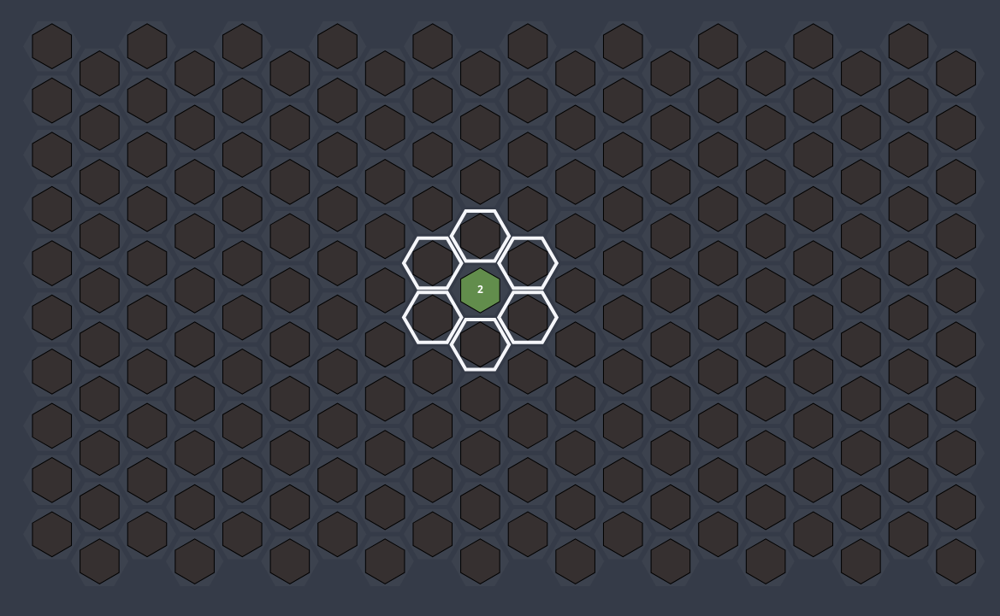
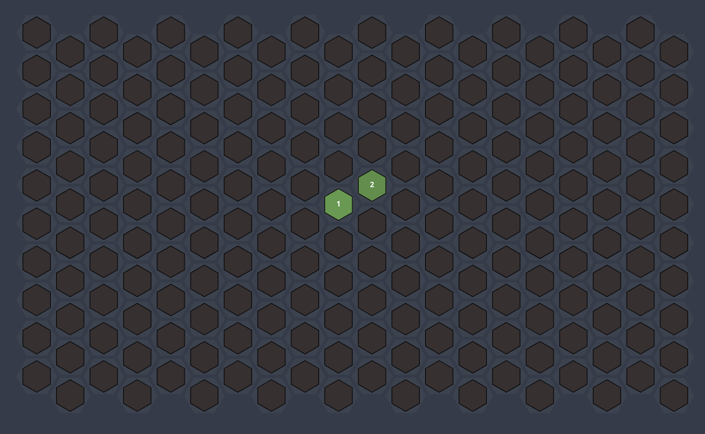
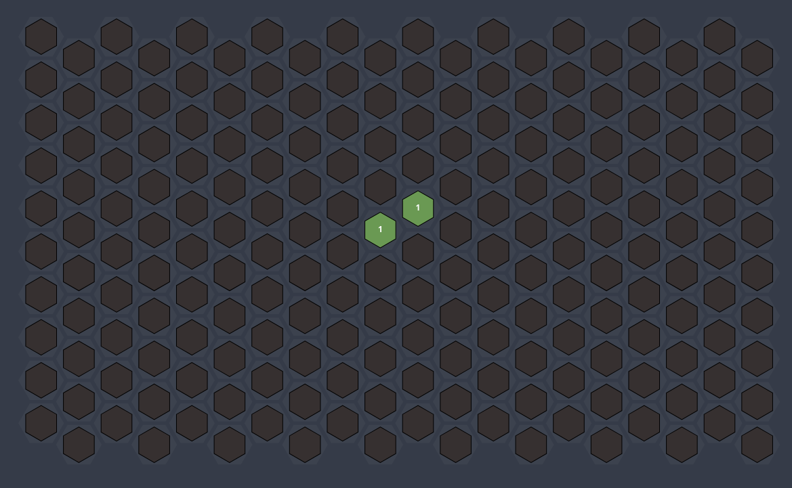
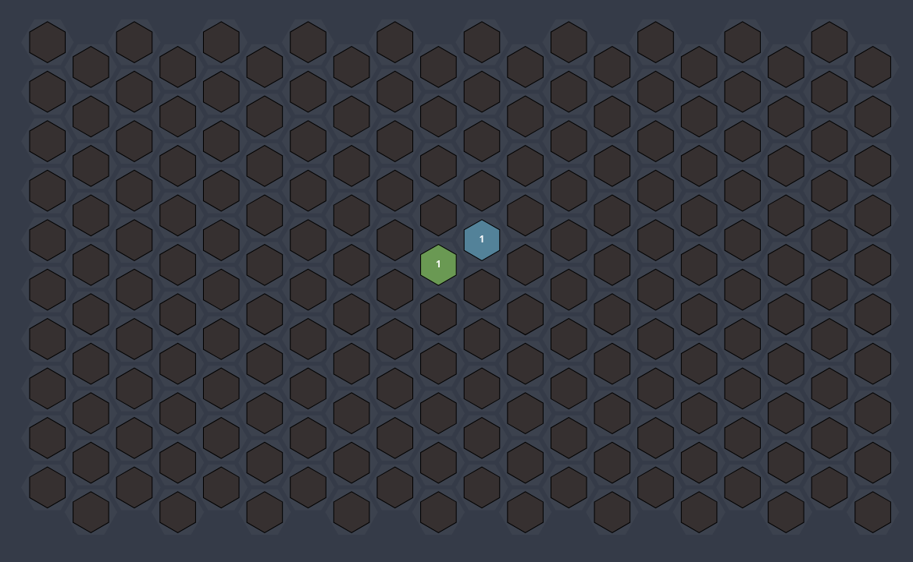
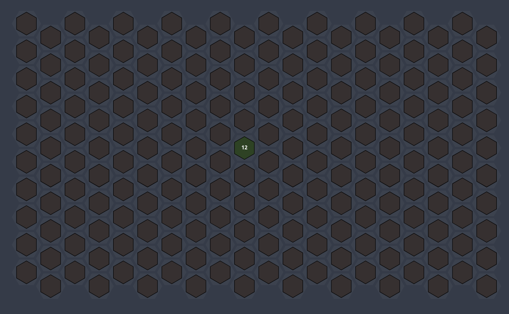

## Game rules

### Поле и ходы

Поле состоит из шестиугольников, соединенных по стороне. 
Пусть вы находитесь в каком-то шестиугольнике(отметим его зеленым), из него вы можете пойти в любой шестиугольник, который с ним граничит, при его наличии и если он не занят вами.

Теперь заметим что на шестиугольнике написана цифра $-$ ваше текущее влияние в данной клетке. Начинаете игру вы в случайной клетке поля, которая имеет влияние равное **двум**. При движении влиеяние расходуется и при переходе в следующую клетку уменьшается на единицу и оставляет единицу в клетке из которой был совершен ход. Разберем на примере с влиянием 3(для наглядности): 

Заметим, что если у вас в клетке осталась единица то мы **не можем** сделать из нее ход.

## Клетки
Клетки поля могут быть двух видов сильные и слабые. Сильные вмещают **12** влияния, а слабые всего **8**.

### Фазы хода

Ход проходит в **2** фазы: **атака** и **оборона**.

### Атака

Предположим вы попали в ситуацию, когда вы стоите рядом с противником. Что же делать тогда? Если у вас в клетке больше единицы влияния вы можете его атаковать. В большинстве случаев более сильная клетка захватывает более слабую, но это не всегда так рассмотрим шансы.

+ 0% $-$ атакующая клетка слабее на 2 и более силы (например 2 атакует 4),

+ 25% $-$ атакующая клетка слабее на 1 очко силы (2 атакует 3)

+ 50% $-$ сила вашей клетки и клетки соперника равны (3 атакует 3)

+ 75% $-$ атакующая клетка сильнее на 1 единицу силы (3 атакует 2),

+ 100% $-$ атакующая клетка сильнее на 2 и более силы (3 атакует 1).

Если ваша клетка выйграла в сражении, то в атакованную клетку переместится влияние в количестве $max(1, you.influence - enemy.influence)$, а в клетке из которой вы атаковали останется единица влияния, кроме случая с разными вместимостями, который мы рассмотрим ниже.

Самое простое $-$ захватывать пустые клетки, т.к. ее можно захватить всегда.

Рассмотрим на примере:

Пусть вы попали в такую ситуацию.

Вы можете атаковать вражескую клетку и получить следующую ситуацию.

Но также не будем забывать про шансы.
Например следующая ситуация может иметь два исхода.

У нас может получиться захватить вражескую клетку либо же нет.

Успех:

Неудача:

Также не забывайте про вместительность клеток. Если например вы хотите перейти из клетки с влиянием 12 в пустую клетку, которая вмещает только 8 влияния то произойдет следующее. В клетку в которую вы идете перейдет 8 влияния, а 4 останется в клетке из которой вы переходили.

`Чем больще влияния, тем темнее визуально клетка`

Вот мы и закончили первую фазу.

## Оборона

В чем заключается оборона, или же распределение влияния. После вашего хода атаки вы попадаете во 2 фазу хода, а именно оборону. После атаки для вас считается количество **захваченных вами клеток**. После этого вы можете распределить это влияние между своими клетками как вам захочется, либо можете воспользоваться функцией автораспределения(всем клеткам поровну, и остаток случайным). Как это выглядит.

Пусть так вы закончили свою фазу атаки, тогда мы имеем на поле 4 наши клетки, значит нам после атаки нужно распределить 4 очка.

Можно сделать это например так:

## Турнир
Все игроки ходят поочереди в порядке определенном изначально. Ход каждого игрока подразумевает собой 2 фазы, описанные выше. Сначала атака, потом оборона.

## Важно!!!
`Ехал Venom через Venom, видит Venom в Venom Venom, сунул Venom Venom в Venom, Venom Venom Venom Venom`
